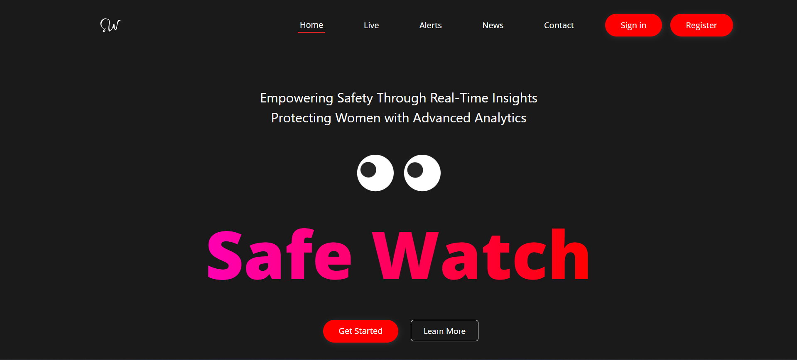
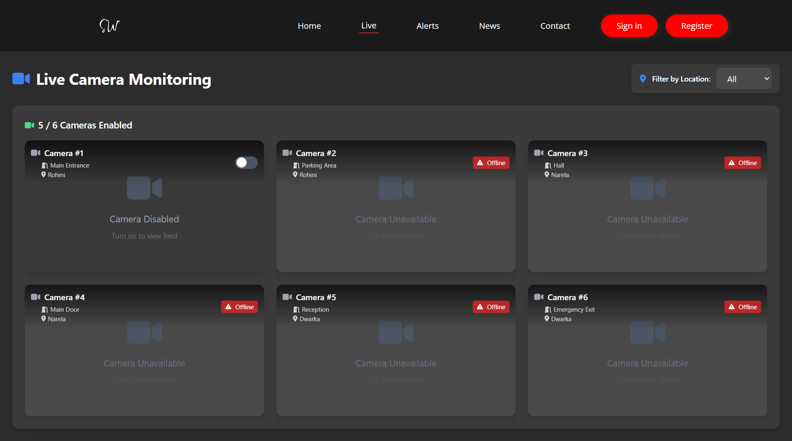
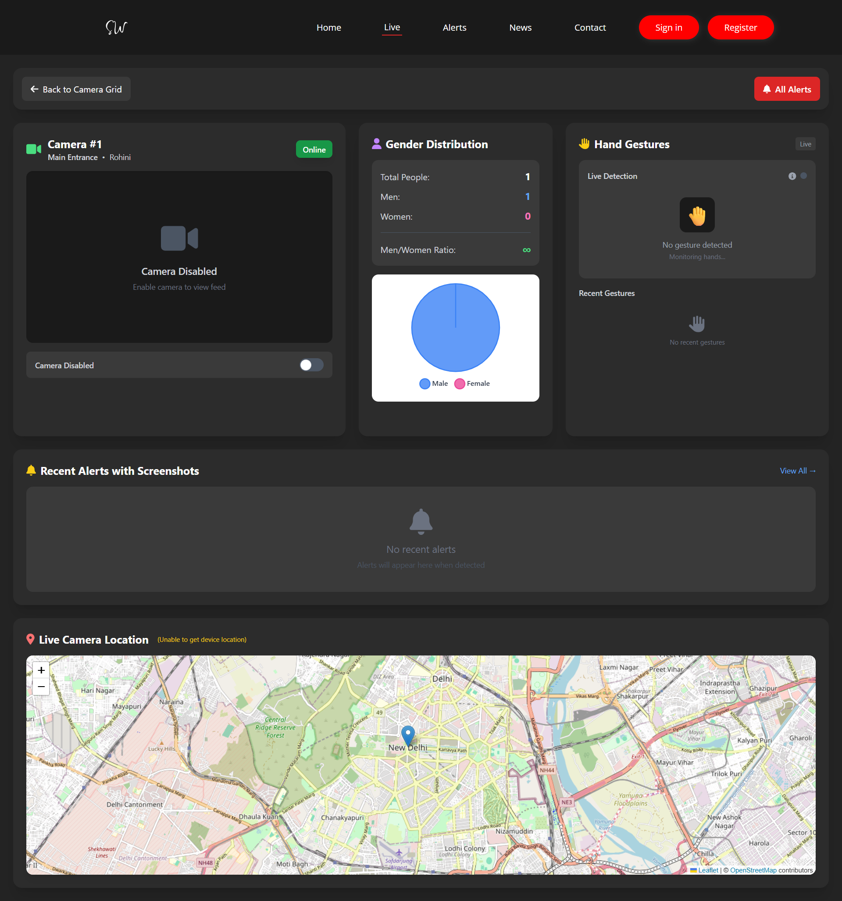
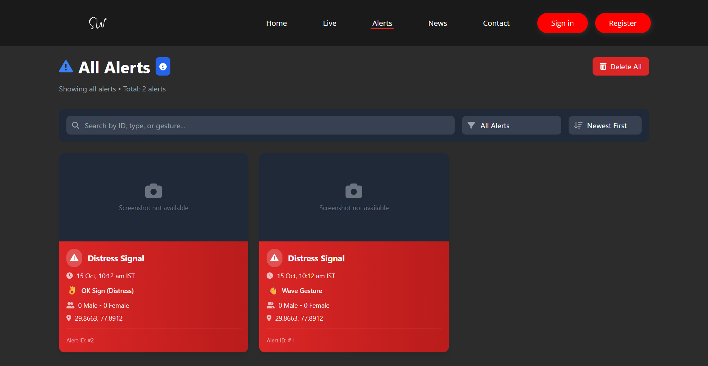
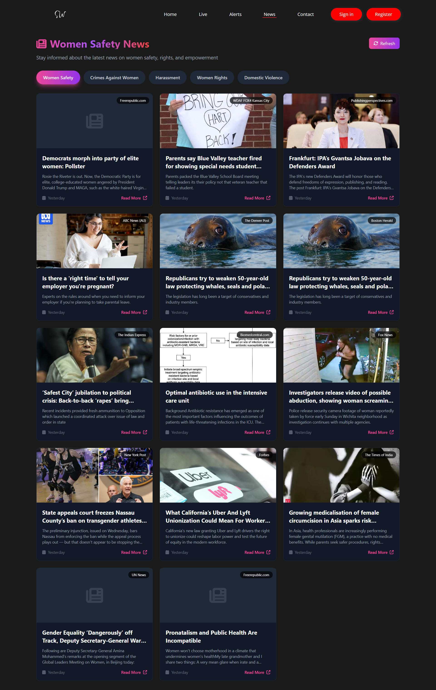

# 🛡️ SafeWatch - AI-Powered Women's Safety Monitoring System

<div align="center">
  
  
  
  
  
  
  
</div>

## 📋 Overview

**SafeWatch** is an innovative AI-driven platform designed to enhance women's safety in public spaces through real-time monitoring, anomaly detection, and intelligent gesture recognition. The system proactively identifies potential threats and alerts authorities, creating a safer environment for women everywhere.

## 📸 Screenshots

### Home Page
<div align="center">
  
  <p><i>Landing page with modern UI and navigation</i></p>
</div>

### Live Camera Monitoring
<div align="center">
  
  <p><i>Multi-camera grid view with real-time monitoring</i></p>
</div>

### Camera Feed with AI Detection
<div align="center">
  
  <p><i>Live video feed with gender detection and person counting</i></p>
</div>

### All Alerts Dashboard
<div align="center">
  
  <p><i>Comprehensive alert management with filtering and statistics</i></p>
</div>

### Alert Detail View
<div align="center">
  
  <p><i>Detailed alert information with full-screen image viewer</i></p>
</div>

### Women Safety News
<div align="center">
  
  <p><i>Latest news articles about women safety with category filters</i></p>
</div>

## 🎯 Key Features

#### 🎥 **Video Monitoring**
- **Real-time Video Feed**: Live camera feed processing with computer vision
- **Multi-Camera Support**: Monitor up to 6 cameras simultaneously in grid view
- **Camera Controls**: Enable/disable individual cameras with toggle switches
- **Location-Based Filtering**: Filter cameras by location (Rohini, Narela, Dwarka)
- **Device Location Tracking**: Live camera location using browser geolocation

#### 🤖 **AI Detection**
- **Gender Detection**: AI-powered gender classification using CNN models
- **Face Detection**: Haar Cascade-based face detection
- **Gesture Recognition**: MediaPipe Hands for distress signal detection
- **Person Counting**: Real-time male/female count with ratio calculation
- **Smart Alert System**: Automated threat detection with configurable cooldown

#### 📊 **Dashboard & Analytics**
- **Modern UI**: Dark-themed interface with TailwindCSS
- **Alert Management**: View, filter, and manage safety alerts
- **Screenshot Gallery**: Capture and download alert frames
- **Gender Distribution**: Pie chart visualization with statistics
- **Hotspot Maps**: Interactive maps with Leaflet integration
- **Recent Alerts**: Real-time alert feed with compact cards

#### 📰 **News Integration** 
- **Women Safety News**: Latest news about women safety and rights
- **Category Filters**: 5 categories (Safety, Crime, Harassment, Rights, Domestic Violence)
- **Real-time Updates**: Refresh to get the latest articles
- **API Integration**: Supports NewsAPI and GNews with easy setup
- **Responsive Cards**: Beautiful card-based layout with images
- **External Links**: Direct links to full news articles

#### 🗺️ **Location Services**
- **GPS Integration**: Geolocation-based camera tracking
- **Interactive Maps**: Leaflet.js for map visualization
- **Alert Circles**: Geographic visualization of incidents
- **Live Camera Markers**: Real-time device location on map

#### ⚙️ **System Features**
- **Database Integration**: SQLite with SQLAlchemy ORM
- **IST Timezone**: Indian Standard Time for all timestamps
- **API Endpoints**: RESTful API for alerts and video feeds
- **Responsive Design**: Mobile-first, fully responsive UI
- **Custom Scrollbars**: Sleek dark-themed scrollbars
- **Dynamic Routing**: React Router v6 with active navigation states

## 🏗️ System Architecture

```
┌─────────────────────────────────────────────────────────────────┐
│                        Frontend (React)                          │
│  ┌────────────┬────────────┬────────────┬──────────────────┐   │
│  │   Home     │   Live     │   Alerts   │     News         │   │
│  │  Landing   │  Camera    │  Management│   Women Safety   │   │
│  │   Page     │   Grid     │   & Detail │    Articles      │   │
│  └────────────┴────────────┴────────────┴──────────────────┘   │
│  ┌──────────────────────────────────────────────────────────┐   │
│  │              Components & UI Elements                     │   │
│  │  • CameraGrid  • AlertCard    • HotspotMap              │   │
│  │  • VideoFeed   • Piegraph     • Navbar (Active States)  │   │
│  │  • Screenshot  • EmptyState   • Footer                  │   │
│  └──────────────────────────────────────────────────────────┘   │
└─────────────────────────────────────────────────────────────────┘
                              ↕ HTTP/REST API
┌─────────────────────────────────────────────────────────────────┐
│                        Backend (Flask)                           │
│  ┌──────────────────────────────────────────────────────────┐   │
│  │                   API Endpoints                           │   │
│  │  /video_feed  • /alerts  • /alert_image/<id>            │   │
│  │  /api/person_count  • /api/stats                        │   │
│  └──────────────────────────────────────────────────────────┘   │
│  ┌──────────────────────────────────────────────────────────┐   │
│  │              Safety Detection Module                      │   │
│  │  • Gender Detection (CNN)                                │   │
│  │  • Face Detection (Haar Cascade)                         │   │
│  │  • Gesture Recognition (MediaPipe Hands)                 │   │
│  │  • Alert Generation & Cooldown Logic                     │   │
│  └──────────────────────────────────────────────────────────┘   │
│  ┌──────────────────────────────────────────────────────────┐   │
│  │              Database (SQLAlchemy + SQLite)               │   │
│  │  • Alert Model (timestamp, location, counts, gesture)    │   │
│  │  • IST Timezone Support (pytz)                           │   │
│  └──────────────────────────────────────────────────────────┘   │
│  ┌──────────────────────────────────────────────────────────┐   │
│  │              External APIs (Optional)                     │   │
│  │  • NewsAPI / GNews - Women safety news integration       │   │
│  └──────────────────────────────────────────────────────────┘   │
└─────────────────────────────────────────────────────────────────┘
```

## 🚀 Getting Started

### Prerequisites

- **Python 3.11+**
- **Node.js 16+**
- **npm or yarn**
- **Webcam/Camera** (for video feed)

### 🔧 Backend Setup

1. **Clone the repository**
   ```bash
   git clone <repository-url>
   cd SheSafe/backend/vihaan-backend
   ```

2. **Create and activate virtual environment**
   ```bash
   # Windows
   python -m venv venv
   venv\Scripts\activate
   
   # macOS/Linux
   python -m venv venv
   source venv/bin/activate
   ```

3. **Install Python dependencies**
   ```bash
   pip install flask flask-cors flask-sqlalchemy opencv-python mediapipe numpy geocoder pytz
   ```

4. **Initialize the database**
   ```bash
   cd ModelPython
   python -c "from safety_detection import db; db.create_all()"
   ```

5. **Run the backend server**
   ```bash
   python app.py
   ```

   The backend will be available at: `http://localhost:5000`

### 🎨 Frontend Setup

1. **Navigate to frontend directory**
   ```bash
   cd frontend
   ```

2. **Install dependencies**
   ```bash
   npm install
   # or
   yarn install
   ```

3. **Required packages**
   ```json
   {
     "react": "^18.3.1",
     "react-dom": "^18.3.1",
     "react-router-dom": "^6.x",
     "leaflet": "^1.9.x",
     "react-leaflet": "^4.x",
     "@fortawesome/react-fontawesome": "^0.2.x",
     "@fortawesome/free-solid-svg-icons": "^6.x",
     "axios": "^1.x"
   }
   ```

4. **Start the development server**
   ```bash
   npm run dev
   # or
   yarn dev
   ```

   The frontend will be available at: `http://localhost:5173`

## 🌐 Browser Permissions

The application requires the following browser permissions:
- **Camera Access**: For video feed (if using browser webcam)
- **Geolocation**: For live camera location tracking on maps
  - Permission prompt will appear on first visit to Camera Detail page
  - Falls back to Delhi coordinates if denied

## 📚 API Documentation

### Core Endpoints

| Endpoint | Method | Description |
|----------|--------|-------------|
| `/video_feed` | GET | Live video stream with AI processing |
| `/alerts` | GET | Retrieve all safety alerts (IST timezone) |
| `/alert_image/<id>` | GET | Get alert frame image by ID |
| `/api/person_count` | GET | Get current male/female count |
| `/api/stats` | GET | Get system statistics |

### Video Feed
```http
GET /video_feed
Content-Type: multipart/x-mixed-replace; boundary=frame
```
Returns a continuous stream of JPEG frames with AI overlays.

### Get Alerts
```http
GET /alerts
```

**Response:**
```json
[
  {
    "id": 1,
    "alert_type": "distress_gesture",
    "timestamp": "2025-10-13T21:30:00+05:30",  // IST timezone
    "latitude": 28.6139,
    "longitude": 77.2090,
    "male_count": 3,
    "female_count": 1,
    "gesture": "help_signal",
    "confidence": 0.85
  }
]
```

### Get Alert Image
```http
GET /alert_image/<alert_id>
Content-Type: image/jpeg
```
Returns the captured frame for a specific alert.

## 🤖 AI Models & Detection

### Gender Detection
- **Model**: Custom CNN trained on gender classification
- **Framework**: OpenCV DNN module
- **Files**: 
  - `gender_deploy.prototxt` - Network architecture
  - `gender_net.caffemodel` - Pre-trained weights
  - `gender_detection3.h5` - TensorFlow model

### Face Detection
- **Algorithm**: Haar Cascade Classifier
- **File**: `haarcascade_frontalface_default.xml`

### Gesture Recognition
- **Framework**: MediaPipe Hands
- **Supported Gestures**:
  - Thumb-palm gesture
  - Wave gesture  
  - Thumb folded gesture
- **Confidence Thresholds**: Configurable per gesture type

### Safety Detection Logic

```python
# Gesture thresholds (configurable)
gesture_thresholds = {
    'thumb_palm': 0.08,
    'wave': 0.3,
    'thumb_folded': 0.12
}

# Alert cooldown: 10 seconds between alerts
alert_cooldown = 10

# Night mode: Enhanced sensitivity (8 PM - 6 AM)
night_start_hour = 20
night_end_hour = 6
```

## 📁 Project Structure

```
SafeWatch/
├── backend/
│   ├── Dockerfile                      # Backend containerization
│   └── ModelPython/
│       ├── app.py                      # Main Flask application
│       ├── app.html                    # Basic HTML interface
│       ├── alert_frames/               # Stored alert screenshots
│       ├── instance/
│       │   └── alerts.db              # SQLite database
│       └── safety_detection/           # AI detection module
│           ├── __init__.py            # Package initializer
│           ├── db.py                  # Database configuration
│           ├── detector.py            # Core detection logic
│           ├── models.py              # SQLAlchemy models (IST timezone)
│           ├── utils.py               # Utility functions
│           └── models/                # AI model files
│               ├── deploy.prototxt
│               ├── gender_deploy.prototxt
│               ├── gender_detection3.h5
│               ├── gender_net.caffemodel
│               └── haarcascade_frontalface_default.xml
│
├── frontend/
│   ├── Dockerfile                     # Frontend containerization
│   ├── package.json                   # Node dependencies
│   ├── vite.config.js                # Vite configuration
│   ├── tailwind.config.js            # TailwindCSS config
│   ├── postcss.config.js             # PostCSS config
│   ├── eslint.config.js              # ESLint configuration
│   ├── index.html                     # Entry HTML
│   ├── public/
│   │   └── images/                    # Static images
│   └── src/
│       ├── main.jsx                   # React entry point
│       ├── App.jsx                    # Main app component
│       ├── App.css                    # Global styles
│       ├── index.css                  # TailwindCSS + custom scrollbar
│       ├── assets/                    # Static assets
│       ├── components/                # Reusable components
│       │   ├── Navbar.jsx            # Navigation (active states)
│       │   ├── Footer.jsx            # Footer component
│       │   ├── CameraGrid.jsx        # Multi-camera grid view
│       │   ├── VideoFeed.jsx         # Single video feed
│       │   ├── AlertCard.jsx         # Alert card component
│       │   ├── ScreenshotCard.jsx    # Screenshot card
│       │   ├── RecentAlerts.jsx      # Recent alerts panel
│       │   ├── HotspotMap.jsx        # Leaflet map component
│       │   ├── HeatmapLayer.jsx      # Heatmap overlay
│       │   ├── Piegraph.jsx          # Gender distribution chart
│       │   ├── RippleButton.jsx      # Animated button
│       │   ├── EmptyState.jsx        # Empty state component
│       │   └── Home/
│       │       ├── eye.jsx           # Eye animation
│       │       └── eye.css           # Eye styles
│       ├── pages/                     # Application pages
│       │   ├── Home.jsx              # Landing page
│       │   ├── Live.jsx              # Live camera grid (location filter)
│       │   ├── CameraDetail.jsx      # Individual camera view
│       │   ├── AllAlerts.jsx         # All alerts page (merged)
│       │   ├── AlertDetail.jsx       # Individual alert view
│       │   ├── Contact.jsx           # Contact page
│       │   ├── Signin.jsx            # Sign in page
│       │   └── Signup.jsx            # Sign up page
│       ├── hooks/
│       │   └── useApi.js             # Custom React hooks for API
│       └── utils/
│           ├── api.js                # API utility functions
│           └── axiosInstance.js      # Axios configuration
│
├── ML_DOCUMENTATION.md                # Comprehensive ML guide
├── CAMERA_STRUCTURE.md                # Camera system documentation
├── TOGGLE_FEATURE_SUMMARY.md          # Toggle implementation details
├── NAVBAR_ACTIVE_STATE.md             # Navbar routing documentation
├── CAMERA_DETAIL_UI_IMPROVEMENTS.md   # UI improvements log
├── README.md                          # This file
└── .gitignore                         # Git ignore rules
```

## 🎨 UI/UX Features

### Navigation
- **Active State Indicators**: Red text + underline for current page
- **Dynamic Route Support**: Highlights parent nav item for detail pages
  - `/camera/:id` keeps "Live" highlighted
  - `/alert/:id` keeps "Alerts" highlighted
- **Smooth Transitions**: 200ms animations on hover/active states

### Camera Features
- **Multi-Camera Grid**: 3-column responsive grid (up to 6 cameras)
- **Location Filtering**: Filter by Rohini, Narela, Dwarka
- **Camera Properties**:
  - `id`: Unique identifier
  - `position`: Specific place (Main Entrance, Hall, etc.)
  - `location`: Area/region (Rohini, Narela, Dwarka)
  - `isOnline`: Backend status (camera availability)
  - `isEnabled`: User toggle control (UI state)
- **Toggle Controls**: iOS-style switches to enable/disable feeds
- **Live Location**: Geolocation API for device coordinates

### Camera Detail Page
- **Streamlined Header**: Back button + All Alerts navigation
- **Camera Info Panel**: ID, position, location, status badge
- **Toggle Below Video**: Enable/disable control under feed
- **Gender Distribution**: 
  - Total people count
  - Male/Female counts
  - **Men/Women Ratio** calculation
  - Pie chart visualization
- **Recent Alerts**: Scrollable list with compact cards
- **Screenshot Gallery**: Horizontal scroll with download/delete
- **Live Location Map**: 
  - Device geolocation marker
  - Alert circles at incident locations
  - Interactive popups with details

### Alert Management
- **Unified Alerts Page**: Merged screenshots and events
- **Tile Format Cards**: Consistent card-based layout
- **Alert Details**: Individual alert view with full information
- **IST Timestamps**: All times in Indian Standard Time

### Styling
- **Dark Theme**: 
  - Background: `#232323`
  - Cards: `#2C2C2C`
  - Secondary: `#3A3A3A`
- **Color-Coded Elements**:
  - 🔵 Blue: Video/Actions
  - 🟣 Purple: Statistics
  - 🟡 Yellow: Alerts/Warnings
  - 🟢 Green: Success/Online
  - 🔴 Red: Errors/Offline
- **Custom Scrollbars**: Sleek dark scrollbars for lists
- **Responsive Design**: Mobile-first, adapts to all screen sizes

## 🔧 Configuration

### Detection Configuration
```python
# In detector.py
config = DetectionConfig(
    alert_cooldown=10,          # Seconds between alerts
    night_start_hour=20,        # Night mode start (8 PM)
    night_end_hour=6,          # Night mode end (6 AM)
    gesture_thresholds={
        'thumb_palm': 0.08,
        'wave': 0.3,
        'thumb_folded': 0.12
    }
)
```

### Camera Configuration
```javascript
// In CameraGrid.jsx or Live.jsx
const cameras = [
  { 
    id: 1,
    position: "Main Entrance",
    location: "Rohini",
    url: "http://localhost:5000/video_feed",
    isOnline: true,
    isEnabled: true
  },
  // ... more cameras
];
```

### Database Configuration
- **Type**: SQLite (development)
- **File**: `instance/alerts.db`
- **ORM**: SQLAlchemy
- **Timezone**: IST (Asia/Kolkata) using `pytz`
- **Models**: 
  - Alert: id, alert_type, timestamp, latitude, longitude, male_count, female_count, gesture

## 🐳 Docker Deployment

### Using Docker Compose
```bash
# Build and run both containers
docker-compose up --build

# Run in detached mode
docker-compose up -d

# Stop containers
docker-compose down
```

### Individual Containers

**Backend:**
```bash
cd backend
docker build -t safewatch-backend .
docker run -p 5000:5000 safewatch-backend
```

**Frontend:**
```bash
cd frontend
docker build -t safewatch-frontend .
docker run -p 5173:5173 safewatch-frontend
```

## 📱 Pages & Routes

| Route | Component | Description |
|-------|-----------|-------------|
| `/` | Home | Landing page with features |
| `/live` | Live | Multi-camera grid with location filter |
| `/camera/:id` | CameraDetail | Individual camera view with stats |
| `/all-alerts` | AllAlerts | All alerts in tile format |
| `/alert/:id` | AlertDetail | Individual alert details |
| `/contact` | Contact | Contact form |
| `/signin` | Signin | Sign in page |
| `/signup` | Signup | Registration page |

## 🧪 Testing

### Backend Testing
```bash
cd backend/ModelPython
python -m pytest tests/
```

### Frontend Testing
```bash
cd frontend
npm test
# or
yarn test
```

### Manual Testing Checklist
- [ ] Video feed loads correctly
- [ ] Gender detection working
- [ ] Gesture recognition functional
- [ ] Alerts generated and stored
- [ ] Camera toggle switches work
- [ ] Location filtering active
- [ ] Maps display device location
- [ ] Alert details page loads
- [ ] Screenshots can be downloaded
- [ ] Navbar active states correct
- [ ] IST timestamps display properly

## 📊 Performance Metrics

- **Detection Speed**: ~30 FPS (real-time processing)
- **Gender Classification Accuracy**: ~85%
- **Gesture Recognition Latency**: <100ms
- **Alert Response Time**: <2 seconds
- **Memory Usage**: ~500MB (with models loaded)

## 🛠️ Troubleshooting

### Common Issues

1. **Camera Access Error**
   ```python
   # Ensure camera permissions are granted
   cap = cv2.VideoCapture(0)  # Try different indices (0, 1, 2)
   ```

2. **Model Loading Error**
   ```bash
   # Ensure model files are in the correct directory
   ls backend/ModelPython/safety_detection/models/
   # Should show: deploy.prototxt, gender_deploy.prototxt, 
   #              gender_net.caffemodel, haarcascade_frontalface_default.xml
   ```

3. **Port Already in Use**
   ```bash
   # Windows (PowerShell)
   netstat -ano | findstr :5000
   taskkill /PID <PID> /F
   
   # macOS/Linux
   lsof -ti:5000 | xargs kill -9
   ```

4. **Geolocation Not Working**
   - Ensure HTTPS or localhost
   - Check browser permissions
   - Falls back to Delhi coordinates if denied

5. **Database Error**
   ```bash
   # Reinitialize database
   cd backend/ModelPython
   rm instance/alerts.db
   python -c "from safety_detection import db; db.create_all()"
   ```

6. **Frontend Build Issues**
   ```bash
   # Clear cache and reinstall
   rm -rf node_modules package-lock.json
   npm install
   ```

7. **Map Not Loading**
   - Check internet connection (loads tiles from OpenStreetMap)
   - Verify Leaflet CSS is imported
   - Check browser console for errors

## 🤝 Contributing

1. **Fork the repository**
2. **Create a feature branch**: `git checkout -b feature-name`
3. **Commit changes**: `git commit -m 'Add feature'`
4. **Push to branch**: `git push origin feature-name`
5. **Submit a Pull Request**

### Development Guidelines
- Follow PEP 8 for Python code
- Use ESLint configuration for JavaScript/React
- Write unit tests for new features
- Update documentation for API changes

## 📜 License

This project is licensed under the MIT License - see the [LICENSE](LICENSE) file for details.

## 👥 Team

- **Backend Development**: Python/Flask, AI/ML Integration
- **Frontend Development**: React.js, UI/UX Design
- **AI/ML Engineering**: Computer Vision, Model Training
- **DevOps**: Docker, Deployment, CI/CD

## 🔮 Future Enhancements

### Planned Features
- [ ] **Mobile Application** (React Native/Flutter)
- [ ] **Real-time Notifications** (WebSocket/Socket.io)
- [ ] **Advanced ML Models** (YOLO v8, Transformer-based)
- [ ] **Cloud Deployment** (AWS/Azure/GCP integration)
- [ ] **Multi-language Support** (i18n/internationalization)
- [ ] **Advanced Analytics Dashboard** 
  - Historical trends
  - Predictive analytics
  - Custom reports
- [ ] **Integration APIs**
  - Emergency services (911/100)
  - IoT devices integration
  - Smart city platforms
- [ ] **Voice Alert System** (Audio processing & TTS)
- [ ] **Facial Recognition** (Optional privacy-respecting mode)
- [ ] **Crowd Density Analysis**
- [ ] **Night Vision Enhancement**
- [ ] **Multi-Camera Synchronization**
- [ ] **User Authentication & Roles**
  - Admin dashboard
  - Security personnel access
  - Public view mode
- [ ] **Video Recording & Playback**
- [ ] **AI-Powered Insights**
  - Pattern recognition
  - Anomaly detection improvements
  - Risk scoring

### In Progress
- ✅ Multi-camera grid view
- ✅ Location-based filtering
- ✅ Live device location tracking
- ✅ Camera toggle controls
- ✅ IST timezone support
- ✅ Gender ratio calculations
- ✅ Dynamic navigation states

## 📞 Support

For support, please contact:
- **GitHub Issues**: [Create an Issue](https://github.com/iamvishalrathi/SheSafe/issues)
- **Repository**: [iamvishalrathi/SheSafe](https://github.com/iamvishalrathi/SheSafe)
- **Branch**: `missing-api`

## 📄 Additional Documentation

- **ML Documentation**: [ML_DOCUMENTATION.md](ML_DOCUMENTATION.md) - Comprehensive ML guide
- **Camera Structure**: [CAMERA_STRUCTURE.md](CAMERA_STRUCTURE.md) - Camera system details
- **Toggle Feature**: [TOGGLE_FEATURE_SUMMARY.md](TOGGLE_FEATURE_SUMMARY.md) - Toggle implementation
- **Navbar States**: [NAVBAR_ACTIVE_STATE.md](NAVBAR_ACTIVE_STATE.md) - Navigation routing
- **UI Improvements**: [CAMERA_DETAIL_UI_IMPROVEMENTS.md](CAMERA_DETAIL_UI_IMPROVEMENTS.md) - UI changelog

## 🏆 Achievements

- ✅ Real-time multi-camera monitoring
- ✅ AI-powered gender and gesture detection
- ✅ Modern, responsive React UI
- ✅ Live geolocation tracking
- ✅ IST timezone support
- ✅ Interactive map visualization
- ✅ Comprehensive alert system

---

<div align="center">
  <p>🛡️ <strong>SafeWatch</strong> - Empowering Safety Through Technology</p>
  <p>Made with ❤️ for women's safety worldwide</p>
  <p><em>Built with React, Flask, OpenCV, MediaPipe & TailwindCSS</em></p>
</div>